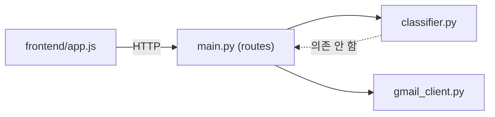
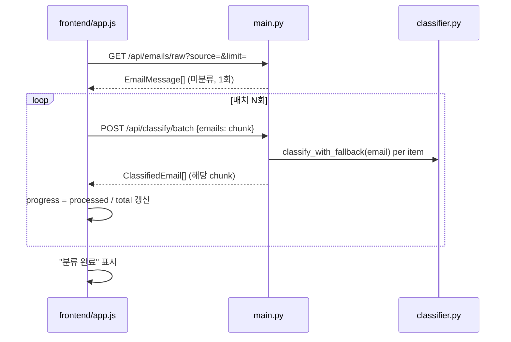
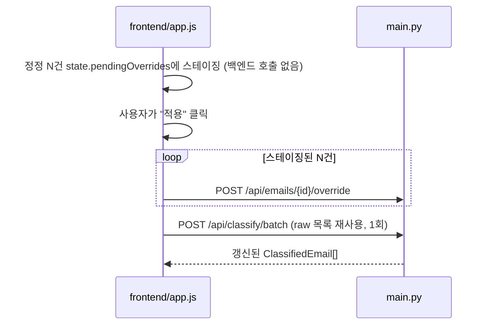

# Architecture Spine — 자봐 분류 규칙 보강 및 기능 확장

## Design Paradigm

무상태 규칙테이블 분류 파이프라인(backend) + 씬 FastAPI 라우트 계층 + 단일 전역 state에서 매번 전체를 재렌더링하는 프론트엔드. 기존 코드에서 그대로 채택한 패턴이며, 이번 작업은 이 패턴을 깨지 않고 확장한다.

- `backend/app/classifier.py` — 분류 규칙 엔진. 순수 함수(`classify_email`, `needs_llm_fallback`, `classify_with_fallback`), 부수효과 없음.
- `backend/app/main.py` — 얇은 라우트 계층. HTTP ↔ 분류 엔진 ↔ Gmail 클라이언트를 연결하는 유일한 지점이며, 유일한 가변 상태(`_overrides`)를 보유한다.
- `backend/app/gmail_client.py` — 외부 Gmail API 어댑터.
- `frontend/app.js` — 단일 `state` 객체 + `render()`가 그 state로부터 전체를 다시 그리는 구조(액션/리듀서 없는 직접 변형 + 재렌더).

의존 방향: `frontend/app.js` → backend HTTP API → (`classifier.py`, `gmail_client.py`). `classifier.py`는 `main.py`/`gmail_client.py`를 알지 못한다(역방향 의존 금지).



## Invariants & Rules

### AD-1 — SECURITY 이중 가드 [ADOPTED]

- **Binds:** `classifier.py` 전체, NFR-1
- **Prevents:** SECURITY로 판정된 메일 내용이 LLM 폴백 경로로 새는 것
- **Rule:** `classify_email()`의 SECURITY 즉시 `return`(87-93)과 `needs_llm_fallback()`의 명시적 재차단(127-135)은 항상 한 쌍으로 유지한다. 한쪽만 리팩토링해 분리하지 않는다.

### AD-2 — 점수 계산식 고정 [ADOPTED]

- **Binds:** `classifier.py` `_RULE_TABLE`, FR-1, FR-2, FR-5, NFR-2
- **Prevents:** 카테고리 추가·키워드 보강 작업이 `score = len(kw_hits) + len(sender_hits) * 2` 공식이나 NEWSLETTER List-Unsubscribe `+2` 보너스를 암묵적으로 바꾸는 것
- **Rule:** 신규 카테고리·키워드·발신자는 `_RULE_TABLE`에 `(Category, KEYWORDS, SENDERS)` 행을 추가/확장하는 것으로만 구현한다. 점수 계산 함수 자체는 수정하지 않는다.

### AD-3 — fetch와 classify 단계 분리

- **Binds:** FR-8, FR-9
- **Prevents:** 진행률 배치마다 source(Gmail)를 반복 재조회해 API 쿼터를 낭비하는 것, 그리고 배치마다 서로 다른 메일 부분집합을 다시 조회해 총 건수/진행률 계산이 어긋나는 것
- **Rule:** 이메일 목록 조회(fetch)와 분류 실행(classify)을 별도 API 단계로 분리한다. 목록은 1회만 가져오고, 분류는 그 목록의 부분집합을 입력으로 받는 배치 호출로 N회 반복한다. 배치 classify 엔드포인트는 입력으로 받은 이메일 목록만 처리하며 source를 다시 조회하지 않는다.

### AD-4 — 일괄 override는 단건 API 반복 + 단일 재분류

- **Binds:** FR-10, FR-11, FR-12
- **Prevents:** 정정 1건마다 전체 재분류(및 Gmail 라벨 일괄 재적용)가 도는 현재 문제(`frontend/app.js:348-355`, `overrideCategory()`가 매번 `runClassify()` 호출)의 재발, 그리고 새 벌크 API와 기존 단건 API의 시맨틱이 갈라지는 것
- **Rule:** `POST /api/emails/{id}/override`의 시그니처는 변경하지 않는다. 프론트엔드는 정정사항을 로컬에 스테이징하고, "적용" 액션 1회당 (1) 스테이징된 건수만큼 override 엔드포인트를 호출한 뒤 (2) AD-3의 classify-batch 경로를 재사용해 재분류를 정확히 1회만 트리거한다. 이 재분류도 source를 재조회하지 않고 이미 메모리에 있는 raw 이메일 목록을 재사용한다.

## Consistency Conventions

| Concern | Convention |
| --- | --- |
| Naming (entities, files, interfaces, events) | 신규 카테고리 상수는 `<CATEGORY>_KEYWORDS` / `<CATEGORY>_SENDERS` 네이밍을 따른다(예: `REPORT_KEYWORDS`, `REPORT_SENDERS`). 신규 엔드포인트는 기존 `/api/<리소스>[/<액션>]` 패턴을 따른다(예: `/api/emails/raw`, `/api/classify/batch`). |
| Data & formats (ids, dates, error shapes, envelopes) | 카테고리 id는 `Category` enum 값(영문 소문자)이 유일한 식별자이며, 한글 라벨(`label_ko`)은 표시 전용이다 — 분류 로직이나 Gmail 라벨명에 라벨 텍스트를 직접 사용하지 않는다. |
| State & cross-cutting (mutation, errors, logging, config, auth) | 백엔드 상태는 `_overrides` 딕셔너리 하나로 한정한다(DB 없음, 프로세스 재시작 시 소실 — `project-context.md` ADR). override는 항상 규칙 기반 재분류 결과보다 우선한다(`_classify_all`이 `_overrides`를 먼저 확인). 프론트엔드 상태는 `state` 전역 객체 하나로 한정한다 — `GET /api/emails/raw` 결과는 분류 여부와 무관하게 `state`의 별도 필드(예: `state.rawEmails`)에 그대로 보관하고, classify-batch 결과로 그 필드를 덮어쓰지 않는다(AD-3/AD-4가 재분류 시 source 재조회 없이 이 필드를 재사용하기 때문). 스테이징된(미적용) 정정은 또 다른 별도 필드(예: `state.pendingOverrides`)로 분리 보관해 "적용" 전까지 백엔드를 호출하지 않는다. |

## Stack

| Name | Version |
| --- | --- |
| fastapi | 0.115.0 |
| uvicorn[standard] | 0.30.6 |
| pydantic | 2.9.2 |
| pydantic-settings | 2.5.2 |
| google-api-python-client | 2.149.0 |
| google-auth / google-auth-oauthlib / google-auth-httplib2 | 2.35.0 / 1.2.1 / 0.2.0 |
| anthropic | 0.39.0 (선택적, 함수 내부 lazy import 유지) |
| pytest / httpx | 8.3.3 / 0.27.2 |
| frontend | 빌드 없는 vanilla HTML/CSS/JS — 신규 의존성 추가 없음 |

신규 의존성 추가 없음 — 이번 작업은 기존 스택 내에서만 구현한다.

## Structural Seed





```text
backend/app/
  classifier.py     # REPORT_KEYWORDS, REPORT_SENDERS 추가, _RULE_TABLE에 행 추가
  schemas.py         # Category.report, CATEGORY_META 항목, MINOR_CATEGORY_ORDER에 배치
  main.py            # GET /api/emails/raw, POST /api/classify/batch 추가 (AD-3/AD-4)
frontend/
  app.js             # 배치 진행률 state, pendingOverrides 스테이징 로직
backend/tests/
  test_classifier.py # 사례 1~4 회귀 테스트 4건 추가 (FR-3, FR-7)
```

## Capability → Architecture Map

| Capability / Area | Lives in | Governed by |
| --- | --- | --- |
| F1 분류 규칙 정확도 보강 (FR-1~3) | `backend/app/classifier.py`, `tests/test_classifier.py` | AD-2 |
| F2 신규 카테고리 "보고서 및 간행물" (FR-4~7) | `backend/app/schemas.py`, `backend/app/classifier.py`, `tests/test_classifier.py` | AD-2 |
| F3 분류 진행률 UI (FR-8~9) | `backend/app/main.py`, `frontend/app.js` | AD-3 |
| F4 수동 정정 일괄 적용 플로우 (FR-10~12) | `backend/app/main.py`(엔드포인트 불변), `frontend/app.js` | AD-4 |

## Deferred

- **PAYMENT 하위 카테고리 분리** (PRD Out of Scope) — 데이터 모델·분류기·프론트엔드 3개 레이어 동시 변경 필요, 다음 라운드로 연기.
- **사용자 지정 카테고리 추가 기능** (PRD Out of Scope) — 영구 저장이 필요해 "DB 없음" ADR과 충돌, 저장 방식부터 재검토 필요한 별도 작업.
- **SECURITY 가드 / 점수 계산식 / LLM 폴백 로직 변경** — 이번 범위에서 절대 금지 (AD-1, AD-2, NFR-4).
- **배치 크기(N)의 구체적 값, `/api/emails/raw` 및 `/api/classify/batch`의 정확한 요청/응답 필드 스키마** — 이 스파인은 "2단계 분리 + 단일 재분류" 원칙만 고정하며, 세부 스키마는 구현 단계에서 결정한다.
- **"국회도서관"(`nanet.go.kr`) 발신자 패턴** — Gmail 조사로 실증되지 않아 FR-5에 포함하지 않음. 향후 실제 수신 시 추가 검토.
